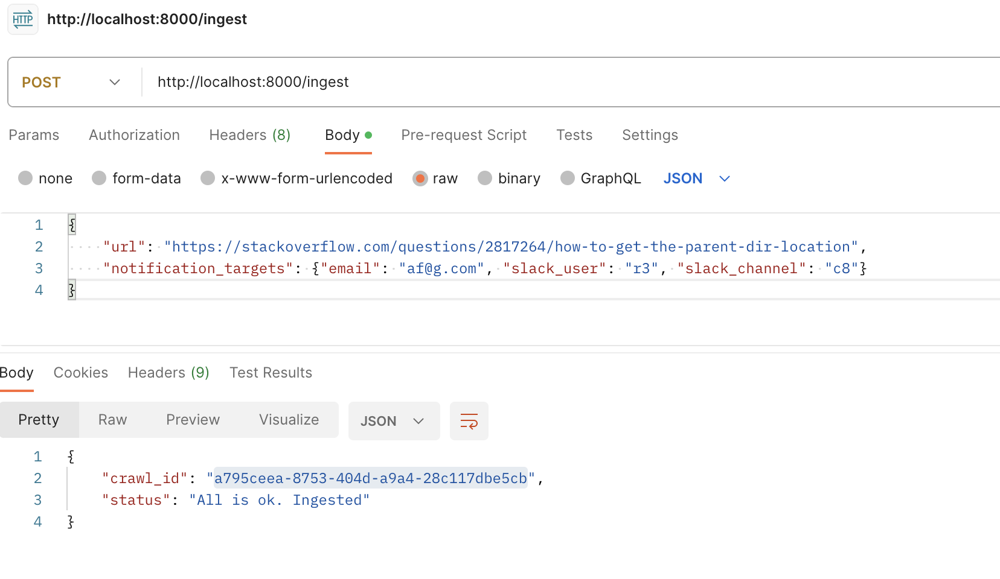
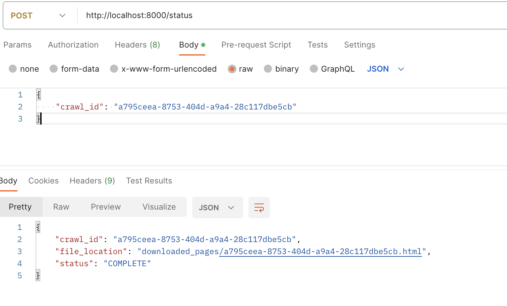

[](https://wakatime.com/badge/user/5ed747b7-0463-4306-99b1-0bf97d1aaa33/project/018dbbf1-65bd-41cc-9680-84d7ad8b4c72)

For running this project:
1. Clone this repository
```
git clone https://github.com/thc128/at-bay-assignment.git
cd at-bay/
```

2. Run with `docker compose`
```
sudo docker-compose up --build -d
```

3. Send a POST request to `http://localhost:8000/ingest`. Example JSON body:
``
{
    "url": "https://stackoverflow.com/questions/2817264/how-to-get-the-parent-dir-location",
    "notification_targets": {"email": "af@g.com", "slack_user": "r3", "slack_channel": "c8"}
}
``


4. Use the `crawl_id` from the response, to send a new POST request to `http://localhost:8000/status`. Example:
```
{
    "crawl_id": "a795ceea-8753-404d-a9a4-28c117dbe5cb"
}
```
